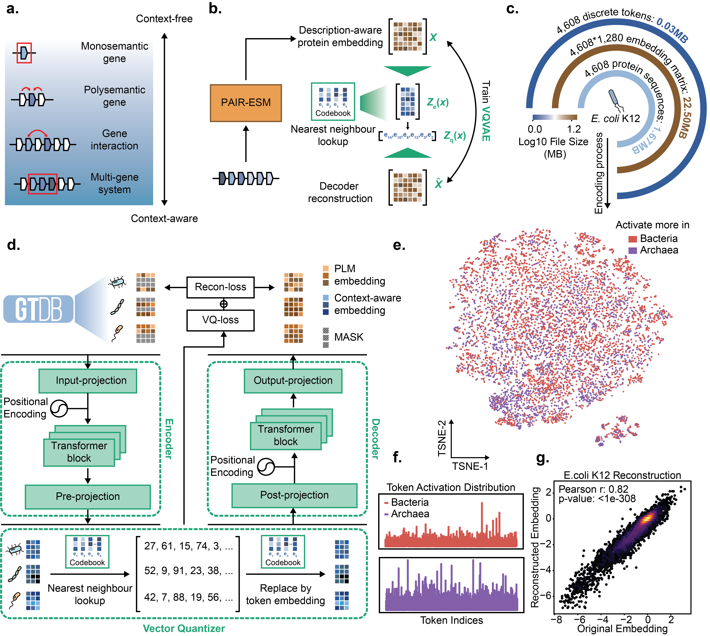

# MicroDVAE 🧬

MicroDVAE is the public inference repository for **MicroVQVAE**, a genome foundation model that learns **discrete, context-aware genome tokens** from ordered protein sequences. By combining **PAIR-esm2** protein embeddings with a **vector-quantized variational autoencoder**, MicroVQVAE transforms prokaryotic genomes into compact and interpretable token representations while preserving local genomic context.

The model is designed for scalable genome representation learning and supports downstream analyses such as genome comparison, functional discovery, and interpretable token-level exploration. In our study, MicroVQVAE learned stable genome tokens, improved phylogenetic clustering across taxonomic levels, achieved strong performance on BacBench tasks, and captured structural and functional relationships beyond conventional sequence similarity.

<p align="center">
  
</p>

## What the CLI does 🚀

Given a protein FASTA file in genomic order, the pipeline will:

1. Load **PAIR-esm2** from Hugging Face.
2. Compute one embedding per protein by mean-pooling the final hidden states.
3. Load a MicroDVAE checkpoint.
4. Convert the ordered protein embeddings into discrete token IDs.
5. Export token IDs and the matched codebook vectors.

## Requirements

- Python 3.10 or newer
- PyTorch
- A GPU is recommended for PAIR-esm2 inference, but CPU mode also works
- Internet access for the first download of `h4duan/PAIR-esm2`, unless you already have a local copy
- A MicroDVAE checkpoint file

Install dependencies:

```bash
pip install -r requirements.txt
```

## Models

### PAIR-esm2

The default embedding model is:

- Hugging Face: `h4duan/PAIR-esm2`
- URL: <https://huggingface.co/h4duan/PAIR-esm2>

You can keep the default or point to a local directory with `--pair-esm-model`.

### MicroDVAE checkpoint

A public MicroDVAE checkpoint is available on Hugging Face 📦:

- URL: <https://huggingface.co/LudensZhang/MicroDVAE/blob/main/model.ckpt>

This repository expects a **local checkpoint path** for `--checkpoint`, so download the file first.

Example:

```bash
mkdir -p checkpoints
wget -O checkpoints/model.ckpt \
  https://huggingface.co/LudensZhang/MicroDVAE/resolve/main/model.ckpt
```

Then pass it to the CLI:

```bash
--checkpoint checkpoints/model.ckpt
```

## Input format

The input must be a **protein FASTA file in genomic order**. The order of proteins in the FASTA is the order that will be tokenized.

Example:

```fasta
>protein_1
MNNRKIAVALAGFATVAQA
>protein_2
MSEKQKIIAIVGCGNIGLELAM
```

## Quick start ⚡

```bash
python scripts/tokenize_genome.py \
  --input examples/example_proteins.faa \
  --checkpoint checkpoints/model.ckpt \
  --output-dir outputs/example
```

## Usage

Basic example:

```bash
python scripts/tokenize_genome.py \
  --input examples/example_proteins.faa \
  --checkpoint checkpoints/model.ckpt \
  --output-dir outputs/example
```

Example with explicit model and device:

```bash
python scripts/tokenize_genome.py \
  --input /path/to/genome_proteins.faa \
  --checkpoint checkpoints/model.ckpt \
  --pair-esm-model h4duan/PAIR-esm2 \
  --device cuda:0 \
  --batch-size 32 \
  --window-size 1024 \
  --output-dir outputs/genome_a
```

### Arguments

- `--input`: protein FASTA file in genomic order
- `--checkpoint`: MicroDVAE checkpoint path
- `--output-dir`: directory for output files
- `--pair-esm-model`: Hugging Face model ID or local model directory
- `--batch-size`: PAIR-esm2 batch size
- `--window-size`: number of proteins processed per dVAE chunk
- `--device`: `auto`, `cpu`, `cuda`, or a specific CUDA device such as `cuda:0`
- `--esm-dtype`: `auto`, `float32`, `float16`, or `bfloat16`
- `--max-length`: maximum amino-acid length passed to PAIR-esm2 for each protein

## Outputs

Each run writes four files into `--output-dir`:

### `tokens.tsv`

Tab-separated table with one row per protein:

- `index`: zero-based protein index in the input FASTA
- `sequence_id`: FASTA record ID
- `description`: FASTA description line
- `length_aa`: protein length
- `token_id`: assigned discrete MicroDVAE token

### `tokens.npy`

NumPy array of shape `(N,)`, where `N` is the number of proteins.

### `codebook_embeddings.npy`

NumPy array of shape `(N, code_dim)`. Each row is the codebook vector corresponding to the assigned token at that protein position.

### `metadata.json`

JSON metadata containing:

- input paths and model identifiers
- number of proteins
- embedding and codebook dimensions
- runtime configuration
- sequence IDs in output order
- checkpoint hyperparameters used to reconstruct the model

## Notes on chunking

Large genomes can contain more proteins than are practical to process in a single dVAE forward pass. The CLI therefore tokenizes the protein embedding sequence in contiguous chunks controlled by `--window-size`. Tokens are concatenated back in the original FASTA order.

## Recommended workflow 🧪

1. Prepare one ordered protein FASTA per genome.
2. Download the public checkpoint from Hugging Face.
3. Run the CLI on each genome.
4. Use `tokens.tsv` for inspection and `tokens.npy` or `codebook_embeddings.npy` for downstream analysis.

## Troubleshooting

### Hugging Face model download fails

- Check network access.
- If the model is already present locally, pass a local directory to `--pair-esm-model`.

### CUDA out of memory

- Reduce `--batch-size`.
- Switch `--esm-dtype` to `float16` on supported GPUs.
- Fall back to `--device cpu` if necessary.

### Input FASTA contains no usable proteins

The CLI skips empty sequences. If all sequences are empty, it will stop with a validation error.

### Checkpoint load fails

Make sure the checkpoint is a compatible MicroDVAE checkpoint with:

- `hyper_parameters`
- `state_dict`
- encoder and VQ weights matching the public inference model

## License

This project is released under the `MIT License`. See [LICENSE](LICENSE) for details.
